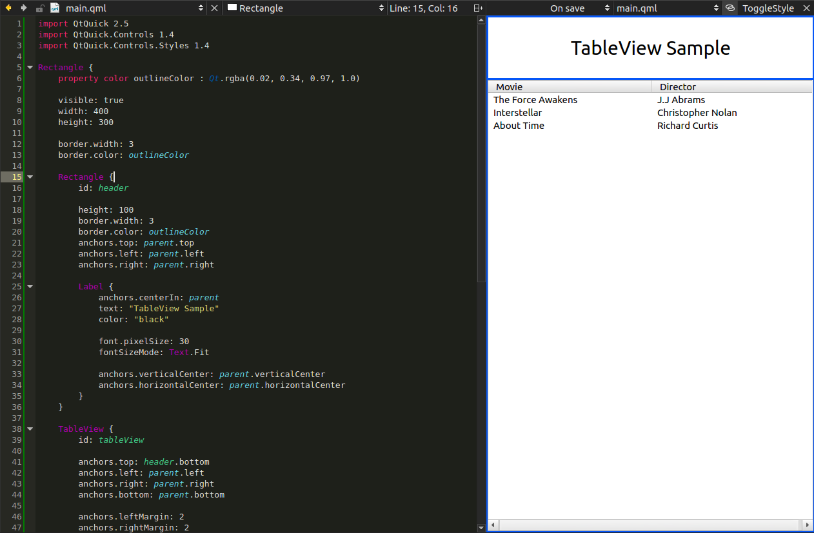

QmlPreviewPlugin for QtCreator
===============================

A plugin to preview QML files within QtCreator.

Features
---------

- The preview can live as a widget in the right pane of QtCreator or as a window.

- Three refresh modes : the preview will refresh if you modify the content of your QML document, or if you save your document, or manually.

- Track the current editor : if it's enabled, the preview will render the QML document displayed in the QtCreator's current editor.

- Your custom QML import paths are automatically loaded.

Limitations
------------

- ApplicationWindow, Window and Screen QML types are not supported as root objects.

- The preview can't handle any QML file which has a C++ backend (e.g. if this file uses a context property).

Build the plugin
-----------------

Put the `qmlpreview` folder in `<QtCreatorSourcesDir>/src/plugins/`.

Now open `<QtCreatorSourcesDir>/src/plugins.qbs` with your favorite text editor and add the project file to the reference list (something like `"qmlpreview/qmlpreview.qbs"`).

Build QtCreator. That's it.

How to use it ?
----------------

Open the `Tools` menu and trigger the action `QML/JS | Show/reload preview`, or use `Ctrl + Alt + X`.

Please note
-----------------

- This plugin is developed for QtCreator >= 3.5.0. I will not test it with earlier versions.

- I use Qbs rather than QMake. It seems that there's currently no way to develop a plugin without having the whole QtCreator project opened.

- WIP !
